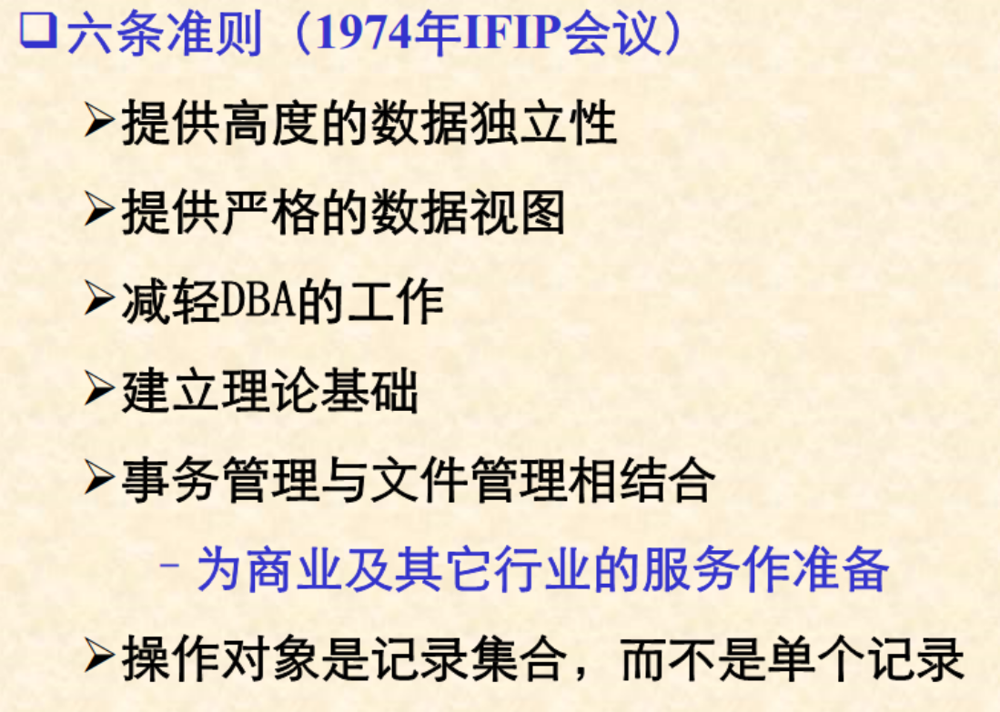

# 关系数据库系统
## 关系数据库系统优点：
1. 数据结构简单：二维表  
2. 使用方便：1）不涉及系统内部物理结构  2）非过程性子语言  
3. 功能强：1）表达能力强，具有一定的模型修改功能 2）可方便地修改数据间的联系 3）可灵活选择数据存取路径 4）高级的数据操控语言
4. 数据独立性高： 1）数据的逻辑结构不涉及物理因素 2）操作的非过程性
5. 理论基础深
6. 可移植性好
7. 标准化程度高：SQL语言标准的制定是关系数据库系统领域的一次革命
8. 分布式功能
9. 开放性：通过提供各种网络环境下的数据访问接口来实现系统的开放性
10. 其他方面的功能拓展

## 关系数据库系统衡量准则
初期的6条准则  

完全关系型的12条严格标准

1)信息准则 2）确保访问准则 3）空值的关系处理准则 4)基于资源管理的动态联机目录 5）统一易用的数据子语言 6）视图更新准则 7）高级的插入，删除及修改操作 8）物理数据独立性 9）逻辑数据独立性 10）数据完整性准则 11）分布独立性 12）无损害原则

## 关系代数——关系模型数学理论

### 一些概念

关系数据结构：表结构 键 关系

关系操纵：增删改查+空值处理

### 表结构

#### 二维表的组成：
1. 表框架（Frame）由n个属性（Attribute）组成，被称作n元表，每个属性有对应值域（domain）。
2. 元组（Tuple) 每行数据称为元组，一个元组由n个元组分量构成。一个表框架有m个元组，m被称为基数。
一个n元表框架以及框架内的m个元组构成一个完整的二维表。

#### 二维表的性质

1）元组个数有限性 2）元组的唯一性 3）元组的次序无关性 4）元组分量的原子性 5）属性名唯一性 6）属性的次序无关性 7）分量值域同一性 同时满足七点的二维表被称为“关系” 以此为基本数据结构所建立的模型为“关系模型”

